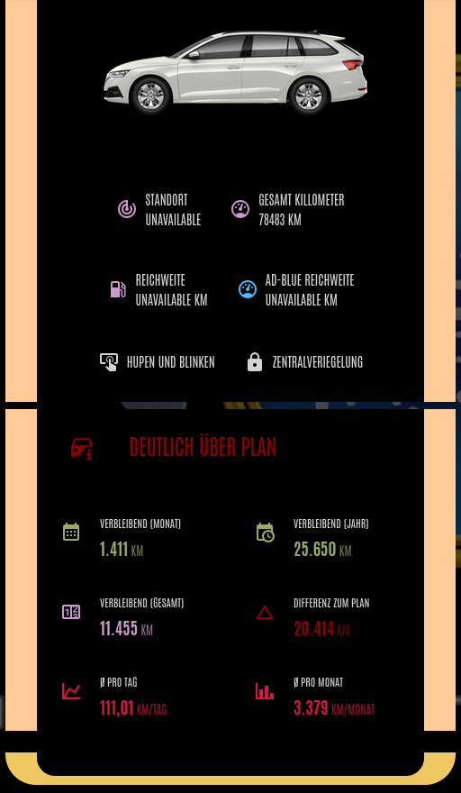

# 🚗 Leasing Tracker für Home Assistant

<p align="center">
  
</p>

<p align="center">
  <a href="https://github.com/foxxxhater/hacs_leasing_tracker/releases">
    
  </a>
  <a href="LICENSE">
    
  </a>
  <a href="https://github.com/hacs/integration">
    
  </a>
</p>

<p align="center">
  Eine Custom Integration für Home Assistant, um Leasingfahrzeuge zu überwachen und verbleibende Kilometer zu berechnen.
</p>

## 📸 Screenshot

<p align="center">
  
</p>

- made with the <a href="https://github.com/WJDDesigns/Ultra-Vehicle-Card" alt="Link to Ultra Vehicle Card">Ultra Vehicle Card</a> and <a href="https://github.com/th3jesta/ha-lcars" alt="Link to HA-LCARS">HA-LCARS</a> because, YES i am a Star Trek Fan...

---

## ✨ Features

- ✅ **22 automatische Sensoren** - Umfassende Überwachung aller Leasingdaten
- ✅ **Tatsächliche + geschätzte Werte**
- ✅ **UI-Konfiguration** - Keine YAML-Konfiguration nötig
- ✅ **Mehrere Fahrzeuge** - Beliebig viele Leasingverträge parallel
- ✅ **HACS kompatibel** - Einfache Installation und Updates
- ✅ **Deutsch + English** - Vollständige Übersetzungen

## 📊 Sensoren

### Verbleibende Kilometer
- Verbleibende KM Gesamt
- Verbleibende KM dieses Jahr (tatsächlich)
- Verbleibende KM diesen Monat (tatsächlich)
- Schätzung Verbleibende KM dieses Jahr
- Schätzung Verbleibende KM diesen Monat

### Gefahrene Kilometer
- Gefahrene KM (gesamt)
- Gefahrene KM diesen Monat
- Gefahrene KM dieses Jahr
- Durchschnitt KM pro Tag
- Durchschnitt KM pro Monat

### Status & Fortschritt
- Status (Im Plan / Über Plan / Unter Plan)
- KM Differenz zum Plan
- Fortschritt (%)
- Verbleibende Tage/Monate

### Vertragsdaten
- Erlaubte KM Gesamt
- Erlaubte KM dieses Jahr
- Erlaubte KM diesen Monat
- Erlaubte KM pro Monat (Durchschnitt)

## 🚀 Installation

### Via HACS - Kommt in Zukunft...

1. HACS in Home Assistant öffnen
2. "Integrationen" → ⋮ → "Benutzerdefinierte Repositories"
3. Repository hinzufügen:
   - URL: `https://github.com/foxxxhater/hacs_leasing_tracker`
   - Kategorie: "Integration"
4. "Leasing Tracker" suchen und installieren
5. Home Assistant neu starten
6. Integration über UI hinzufügen

### Manuell (aktuell nur möglich)

1. Lade Sie die neueste Version herunter: [Releases](https://github.com/foxxxhater/hacs_leasing_tracker/releases)
2. Entpacke Sie das Archiv
3. Kopieren Sie den `leasing_tracker` Ordner nach `custom_components/`
4. Home Assistant neu starten
5. Integration über UI hinzufügen

## ⚙️ Konfiguration

### Schritt 1: Kilometerstand-Sensor erstellen (Optional)
(Wenn keine Entität von Ihrem Auto zur verfügung steht)

Fügen Sie der `configuration.yaml` hinzu:

```yaml
input_number:
  car_mileage:
    name: "Auto Kilometerstand"
    min: 0
    max: 500000
    step: 1
    unit_of_measurement: "km"
    icon: mdi:counter
```

### Schritt 2: Integration hinzufügen

1. **Einstellungen** → **Geräte & Dienste**
2. **+ Integration hinzufügen**
3. Suche: **"Leasing Tracker"**
4. Formular ausfüllen:
   - Name (z.B. "BMW 3er Leasing")
   - Kilometerstand-Sensor
   - Start-/End-Datum
   - Start-KM
   - Erlaubte KM/Jahr

### Schritt 3: Fertig! 🎉

Alle Sensoren werden automatisch erstellt und aktualisieren sich bei Änderung des Kilometerstands.

## 📱 Dashboard Beispiele

### Kompakte Übersicht
```yaml
type: entities
title: 🚗 Mein Leasing
entities:
  - sensor.bmw_3er_status
  - sensor.bmw_3er_verbleibende_km_monat
  - sensor.bmw_3er_verbleibende_km_jahr
  - sensor.bmw_3er_km_differenz_zum_plan
  - sensor.bmw_3er_gefahrene_km
```

## 🔔 Beispiel Automatisierung

Benachrichtigung bei zu vielen Kilometern:

```yaml
automation:
  - alias: "Leasing Warnung"
    trigger:
      platform: numeric_state
      entity_id: sensor.bmw_3er_km_differenz_zum_plan
      above: 500
    action:
      service: notify.mobile_app
      data:
        title: "⚠️ Leasing Warnung"
        message: "Du bist {{ states('sensor.bmw_3er_km_differenz_zum_plan') }} km über dem Plan!"
```

## 📚 Dokumentation

- [📝 Changelog](CHANGELOG.md)

## 🐛 Fehler & Probleme
→ [Issue erstellen](https://github.com/foxxxhater/hacs_leasing_tracker/issues)

## 🤝 Beitragen

Contributions sind willkommen! 

1. Forken Sie das Repository
2. Erstelle Sie einen Feature Branch (`git checkout -b feature/AmazingFeature`)
3. Commit Sie Ihre Änderungen (`git commit -m 'Add some AmazingFeature'`)
4. Push zum Branch (`git push origin feature/AmazingFeature`)
5. Öffnen Sie einen Pull Request

## 📄 Lizenz

Dieses Projekt ist unter der MIT License lizenziert - siehe [LICENSE](LICENSE) für Details.

## 💬 Support

- 🐛 [Issues](https://github.com/foxxxhater/hacs_leasing_tracker/issues)
- 💡 [Discussions](https://github.com/foxxxhater/hacs_leasing_tracker/discussions)
- 🏠 [Home Assistant Community Forum](https://community.home-assistant.io/)

## ⭐ Danke!

Wenn Ihnen diese Integration hilft, geben Sie dem Projekt gerne einen Stern! ⭐

---

Entwickelt mit ❤️ für die Home Assistant Community

P.S. mit freundlicher Unterstüzung con Claude
